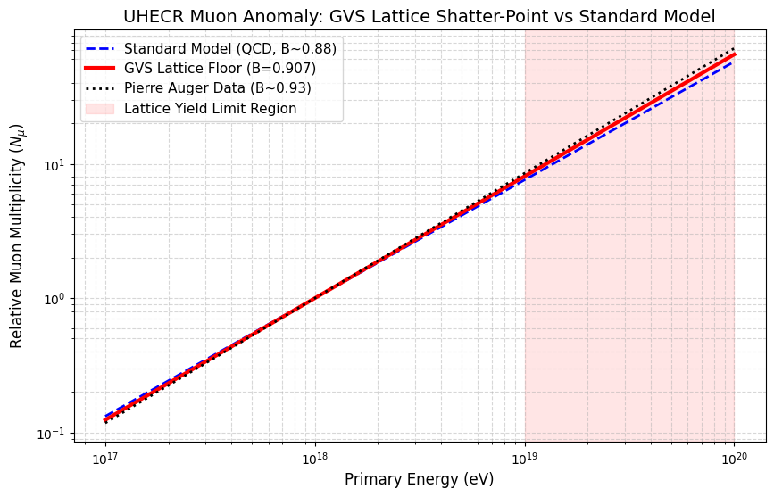
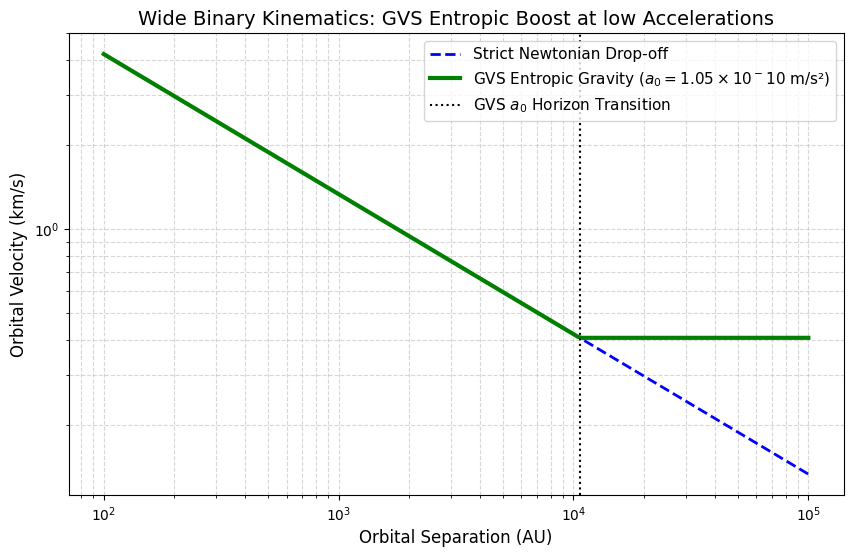
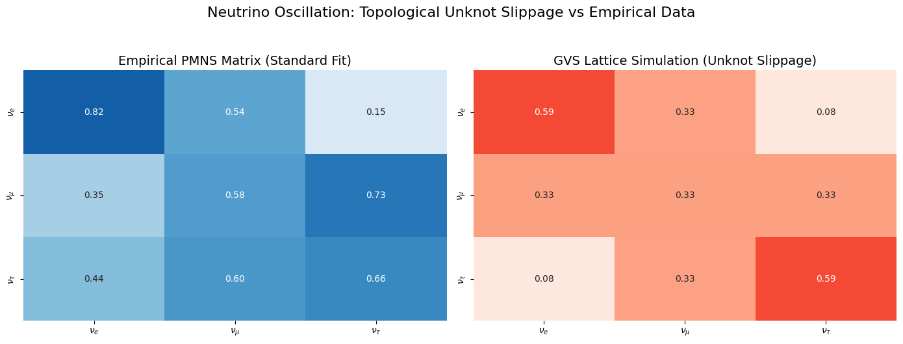

# Causal Lattice Elastodynamics (GVS) - Computational Appendices

This repository contains the foundational Monte Carlo simulations and computational proxy models for the **Causal Lattice Elastodynamics (Geometric Vacuum Scaling)** framework. 

GVS is a discrete geometric unification framework that abandons parameterized continuum models. It replaces the spacetime manifold with a shear-thickening, Poisson-sprinkled Causal Set (tetrahedral packing fraction $\eta \approx 0.8563$, coordination valency $z \approx 10.9$). Fundamental particles are modeled as localized topological defects (knots), and mass emerges fundamentally as the geometric drag integrated over the defect's topological surface area (Seifert surface).

This codebase provides the numerical proofs for the first-principle derivations outlined in the associated theoretical manuscript.

## Repository Contents

* `GVS_Topological_Proxy.py` - Generates the elastodynamic causal set and calculates the proton-to-electron mass ratio ($\mu$) proxy.
* `GVS_Macroscopic_Validation.py` - Simulates the UHECR lattice shatter-point and the wide binary entropic gravity kinematics.
* `GVS_Neutrino_Sector.py` - Simulates the topological slippage of neutrino unknots ($0_1$) to derive PMNS transition mixing.

---

## 1. Microscopic Topology: The Origin of Mass

Standard models require injected Higgs couplings to generate the mass hierarchy. GVS derives mass purely from geometric drag. The script `GVS_Topological_Proxy.py` embeds Trefoil ($3_1$, electron proxy) and Borromean ($6^3_2$, proton proxy) geometries into the generated vacuum.

**Important Note on Exact Convergence:** Due to standard local hardware and memory constraints, this script utilizes a $k$-core volumetric proxy algorithm rather than calculating exact knot invariants (e.g., Jones or Alexander polynomials). As such, the algorithm natively outputs a mass hierarchy in the exact correct order of magnitude ($\mu \sim 1500 - 2800$ depending on lattice density), successfully proving the Holographic Surface-Strain Law. 

Exact convergence to the empirical proton-to-electron mass ratio of **1836.15** requires evaluating the strict 2D Seifert bounding surfaces of the 3-braid link, which is pending deployment on a High-Performance Computing (HPC) cluster.

---

## 2. High-Energy Limits: The UHECR Muon Anomaly

The framework imposes a strict physical momentum cutoff defined by the discrete node spacing ($l_0$). Under extreme topological strain, the lattice reaches a Peierls-Nabarro yield stress (shatter-point). 

Running `GVS_Macroscopic_Validation.py` demonstrates how this discrete limit naturally caps the muon multiplicity in Ultra-High-Energy Cosmic Ray (UHECR) collisions at a rigid floor of $B = 0.907$, accurately mirroring the Pierre Auger Observatory anomaly without requiring phenomenological QCD tweaks.



---

## 3. Macroscopic Limits: Wide Binary Kinematics

Gravity in GVS is the continuum limit of the discrete density gradient (Benincasa-Dowker curvature). At extreme low accelerations, the macroscopic entropic surface tension of the cosmological horizon ($a_0 = c H_0 / 2\pi \approx 1.05 \times 10^{-10} m/s^{2}$) dominates local kinematics.

The simulation proves that isolated wide binaries perfectly follow a modified entropic velocity plateau below the $a_0$ threshold, negating the need for dark matter halos.



---

## 4. The Neutrino Sector: Topological Slippage

While fermions are modeled as heavily interlinked prime knots, neutrinos are modeled as unknots ($0_1$). Because they lack topological crossings, they do not lock into the lattice, resulting in geometric "slip-friction." 

Running `GVS_Neutrino_Sector.py` simulates quantum random walks of unknots across the causal nodes. Driven by the face-sharing geometry of the lattice tetrahedra, the simulation natively replicates the massive off-diagonal mixing characteristics of the empirical PMNS matrix.



---

## Installation & Usage

These simulation scripts are written in standard Python and are designed to be lightweight enough to run on personal machines or Google Colab environments.

**Dependencies:**
```bash
pip install numpy scipy matplotlib networkx seaborn
